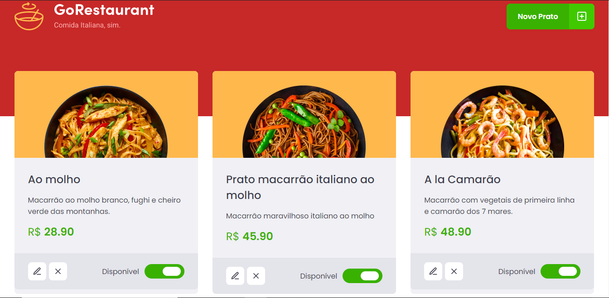

<h1 align="center">
    
</h1>

## Sobre o desafio

Nesse desafio, você irá desenvolver mais uma aplicação, a GoRestaurant. Agora você irá praticar o que você aprendeu até agora no React.js junto com TypeScript, praticando o conceito de CRUD (Create, Read, Update, Delete).

Essa será uma aplicação que irá se conectar a uma fake API, e exibir os pratos de comida criados e permitir a criação, remoção e atualização desses pratos.

## Layout do desafio

    

## Funcionalidades da aplicação

- [x] Listar os pratos de comida da sua API
- [x] Adicionar novos pratos de comida a sua API
- [x] Editar pratos de comida da sua API
- [x] Remover pratos de comida da sua API
- [x] Alterar disponibilidade dos pratos de comida da sua API

Feito com ❣️ por Fabricio Ignacio de Espindola
